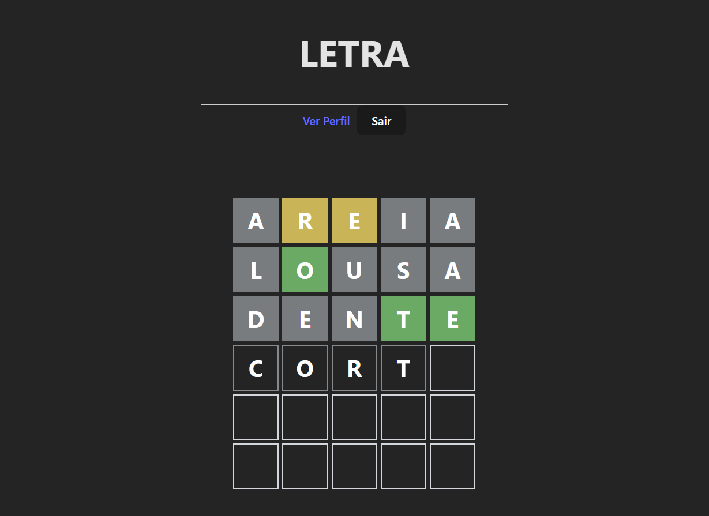

# Clone do Jogo Termo (Full-Stack)


*Um clone funcional do popular jogo de palavras Termo/Wordle, desenvolvido como uma aplicação web completa com front-end, back-end e banco de dados relacional.*

*Por Gabriel Campos e Gabriel Couto*


---

## 📋 Índice

* [Sobre o Projeto](#sobre-o-projeto)
* [Principais Funcionalidades](#principais-funcionalidades)
* [Tecnologias Utilizadas](#tecnologias-utilizadas)
* [Iniciando o Projeto Localmente](#iniciando-o-projeto-localmente)
  * [Pré-requisitos](#pré-requisitos)
  * [Instalação](#instalação)
* [Executando a Aplicação](#executando-a-aplicação)
* [Licença](#licença)

---

## 📖 Sobre o Projeto

Este projeto foi desenvolvido como requisito para a disciplina de Programação Web, com o objetivo de criar uma aplicação full-stack funcional e demonstrar domínio sobre os conceitos fundamentais da área.

A aplicação replica a experiência do jogo Termo, mas a expande com funcionalidades de contas de usuário, permitindo que cada jogador tenha seu próprio histórico de partidas, estatísticas de desempenho e um perfil que pode ser gerenciado através de operações **CRUD** completas (Create, Read, Update, Delete).

---

## ✨ Principais Funcionalidades

* **Autenticação de Usuários:** Sistema seguro de cadastro e login com senhas criptografadas e tokens de acesso (JWT).
* **Lógica Completa do Jogo:**
    * Grid interativa para adivinhar a palavra de 5 letras.
    * Validação de letras corretas, presentes e ausentes, incluindo tratamento de letras duplicadas.
    * Palavras do dia carregadas a partir do back-end.
* **Perfil de Usuário e Estatísticas:**
    * Página de perfil individual que exibe estatísticas como total de jogos, vitórias e taxa de sucesso.
    * Histórico detalhado de todas as partidas jogadas.
* **CRUD Completo de Usuário:**
    * **Create:** Cadastro de novos usuários.
    * **Read:** Visualização dos dados do perfil.
    * **Update:** Edição de nome, e-mail e senha.
    * **Delete:** Deleção permanente da conta e de todos os dados associados (partidas).
* **Arquitetura Robusta:** O back-end foi construído seguindo uma arquitetura em camadas (Controllers, Services, Repositories) para separação de responsabilidades e manutenibilidade.

---

## 🛠️ Tecnologias Utilizadas

A aplicação é dividida em duas partes principais:

### **Front-end (pasta `client`)**
* **React:** Biblioteca principal para a construção da interface.
* **Vite:** Ferramenta de build e servidor de desenvolvimento de alta performance.
* **TypeScript:** Para adicionar tipagem estática e segurança ao código.
* **Axios:** Cliente HTTP para comunicação com a API do back-end.
* **React Router DOM:** Para gerenciamento de rotas e criação de uma Single-Page Application (SPA).
* **Context API:** Para gerenciamento de estado global, principalmente da autenticação.

### **Back-end (pasta `server`)**
* **Node.js:** Ambiente de execução do JavaScript no servidor.
* **Express:** Framework para a construção da API REST.
* **TypeScript:** Para um desenvolvimento mais robusto e seguro no back-end.
* **Prisma:** ORM (Object-Relational Mapping) moderno para interagir com o banco de dados de forma intuitiva e segura.
* **SQLite:** Banco de dados relacional baseado em arquivo, ideal para desenvolvimento e portabilidade.
* **JWT (JSON Web Token) & Bcrypt.js:** Para autenticação segura e criptografia de senhas.

---

## 🚀 Iniciando o Projeto Localmente

Siga os passos abaixo para executar a aplicação em seu ambiente de desenvolvimento.

### Pré-requisitos

Antes de começar, você vai precisar ter as seguintes ferramentas instaladas:
* [Node.js](https://nodejs.org/en/) (versão LTS recomendada)
* [Git](https://git-scm.com/)

### Instalação

1.  **Clone o repositório:**
    ```bash
    git clone [https://github.com/GabrielSCouto/wordle-clone-project.git](https://github.com/GabrielSCouto/wordle-clone-project.git)
    cd wordle-clone-project
    ```

2.  **Configure o Back-end:**
    ```bash
    # Navegue para a pasta do servidor
    cd server

    # Instale as dependências
    npm install

    # Crie o arquivo de variáveis de ambiente
    # Crie um arquivo chamado .env e copie o conteúdo de .env.example para ele
    # (Se .env.example não existir, crie o .env com o conteúdo abaixo)
    ```
    Conteúdo para o arquivo `.env` na pasta `server`:
    ```
    # Endereço do banco de dados (Prisma usará um arquivo local)
    DATABASE_URL="file:./dev.db"

    # Chave secreta para os tokens JWT. Troque por uma frase longa e segura.
    JWT_SECRET="SUA_CHAVE_SECRETA_MUITO_SEGURA_AQUI"
    ```
    ```bash
    # Rode as migrações para criar o banco de dados e as tabelas
    npx prisma migrate dev

    # Rode o script de "seed" para popular o banco com as palavras iniciais
    npx prisma db seed
    ```

3.  **Configure o Front-end:**
    ```bash
    # Volte para a raiz e navegue para a pasta do cliente
    cd ../client

    # Instale as dependências
    npm install
    ```

---

## ▶️ Executando a Aplicação

Para rodar a aplicação, você precisará de **dois terminais abertos**.

1.  **Terminal 1 (Back-end):**
    ```bash
    # Navegue até a pasta do servidor
    cd server

    # Inicie o servidor de desenvolvimento
    npm run dev
    ```
    *O back-end estará rodando em `http://localhost:3001`.*

2.  **Terminal 2 (Front-end):**
    ```bash
    # Navegue até a pasta do cliente
    cd client

    # Inicie o servidor de desenvolvimento
    npm run dev
    ```
    *O front-end estará acessível em `http://localhost:5173`.*

Agora, abra seu navegador e acesse `http://localhost:5173` para usar a aplicação!

---
